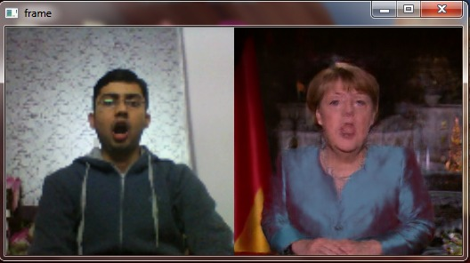
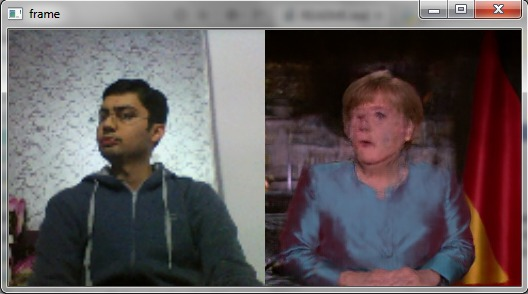
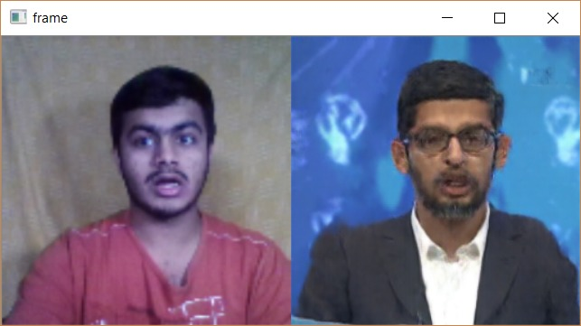

# face2face-demo
It takes live feed of source actor as input and reenacts the poses and expressions on the face of a target actor which is trained by the model earlier. It uses Pix2Pix tensorflow to train GAN’s to map user landmark features to the face of person in the video. In order to run the model in real time, the original model has been reduced to smaller lightweight model.

## Examples:

